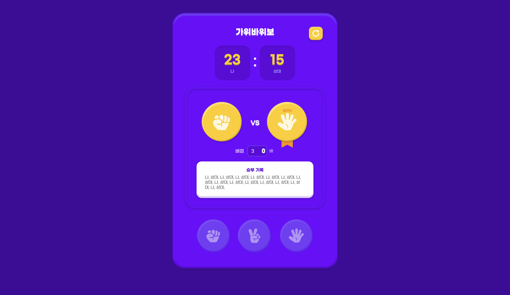
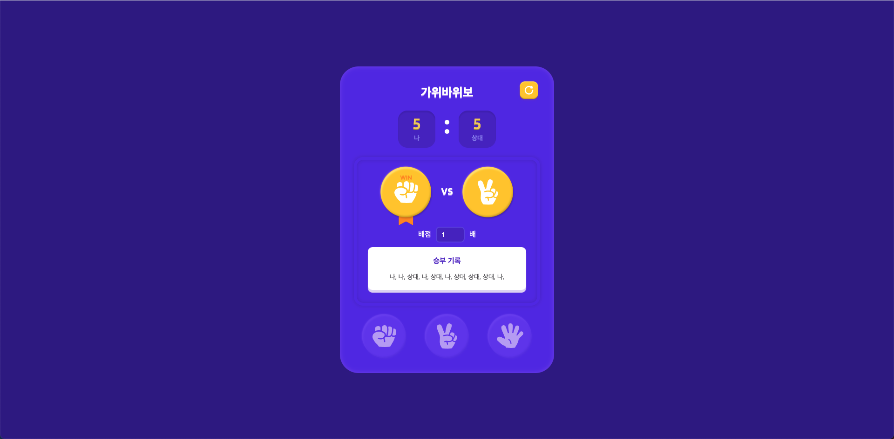
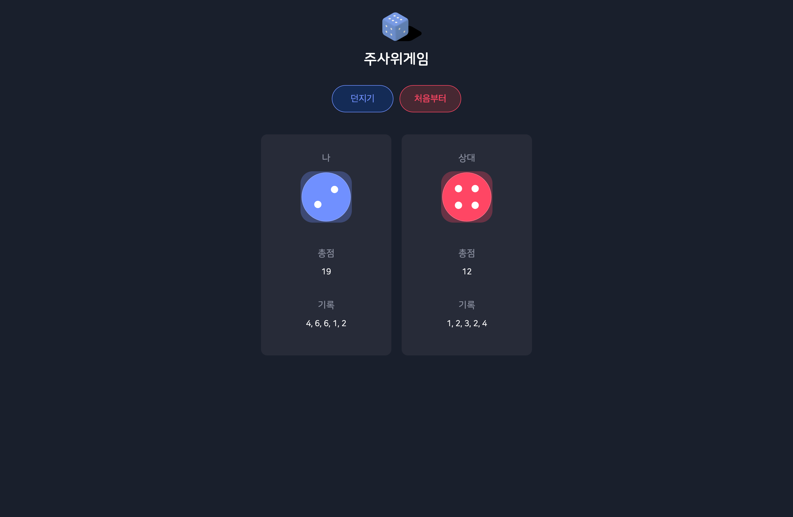
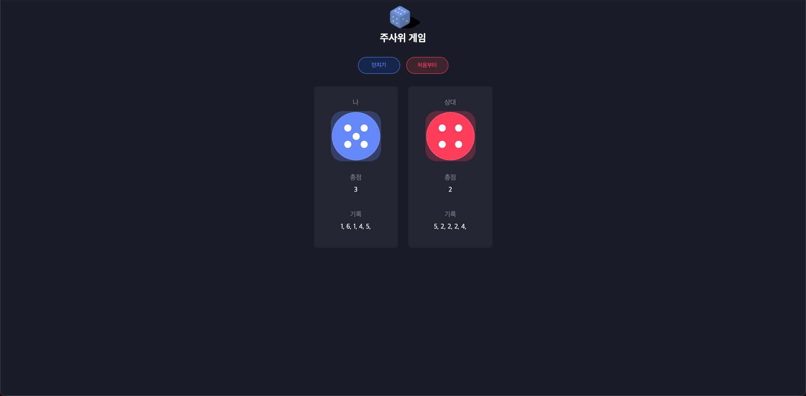
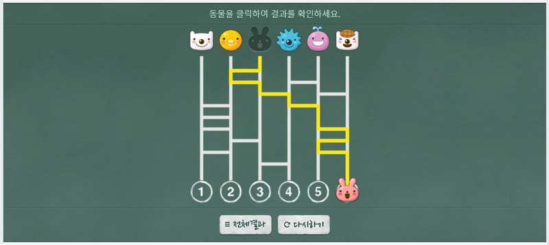

# 미니게임 웹사이트 사이드 프로젝트 - This is Mini Game Side Project

*Git 충돌이 일어나서 다시 초기화 진행 
(아래는 실제 프로젝트를 진행한 이력)

## [개발 완료 상황]
### [ver 1]
1. 가위, 바위, 보 게임 500x944 사이즈 크기로 디자인 및 필요 기능 추가 완료 (2021.10.03)
2. 주사위 게임 500x944 사이즈 크기로 디자인 및 필요 기능 추가 완료 (2021.10.05)

# 1. 가위, 바위, 보 게임 ✌ ✋ ✊

### [개발 진행 상황]
- 2021년 9월 28일 미니게임 프로젝트 시작
- 2021년 9월 30일 '가위,바위,보' 게임 레이아웃 디자인 1차 완료
- 2021년 10월 1일 'SASS' 파일 디자인 수정, 버튼 클릭시 결과 이미지 변경
- 2021년 10월 2일 상대 결과 선택 랜덤, 승부 결과 점수 카운트, 초기화
- 2021년 10월 3일 배점에 따른 승부 결과 추가 점수 획득, 승부기록 텍스트 추가

[목표 디자인 출처 : 코드잇]

[목표 디자인 완성!]

### [구현 포인트 ✨]
- 최소한의 이미지 리소스만 가지고 목표 디자인과 최대한 비슷하게 디자인 하기.

### [어려웠던 점 😂]
- 박스 윤곽선을 디자인하고 그 위에 컴포넌트들을 배치하는 것이 어려웠습니다.

### [추후 추가 개발 예정]
1. 반응형으로 만들기
2. 승부기록 많아지는 경우 윤곽선 박스 크기와 버튼 위치 수정
3. 리팩토링 하여 클린 코드로 작성하기

## 2. 주사위 게임 🎲

### [개발 진행 상황]
- 2021년 10월 4일 간단한 라우트 추가, 주사위 게임 레이아웃 디자인 및 컴포넌트 1차 개발
- 2021년 10월 5일 주사위 게임에 필요한, 던지기&처음부터 기능 추가, 결과에 따른 총점 및 기록 기능 추가

[목표 디자인 출처 : 코드잇]

[목표 디자인 완성!]

### [구현 포인트 ✨]
- 최소한의 이미지 리소스만 가지고 목표 디자인과 최대한 비슷하게 디자인 하기.

### [추후 추가 개발 예정]
1. 반응형으로 만들기
2. 리팩토링 하여 클린 코드로 작성하기

## 3. 사다리 타기 게임 🪜

### [개발 진행 상황]

[목표 디자인 출처 : 네이버]

### [구현 포인트 ✨]
- 최소한의 이미지 리소스만 가지고 목표 디자인과 최대한 비슷하게 디자인 하기.

### [추후 추가 개발 예정]
1. 반응형으로 만들기
2. 인원수를 입력받아서 사다리 생성하기
3. 리팩토링 하여 클린 코드로 작성하기

## 4. 캐치 마인드 게임

## 5. 마피아 & 라이어 게임
